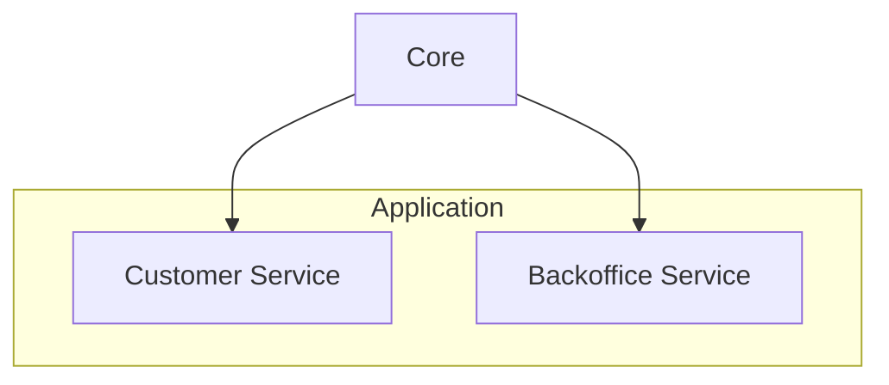
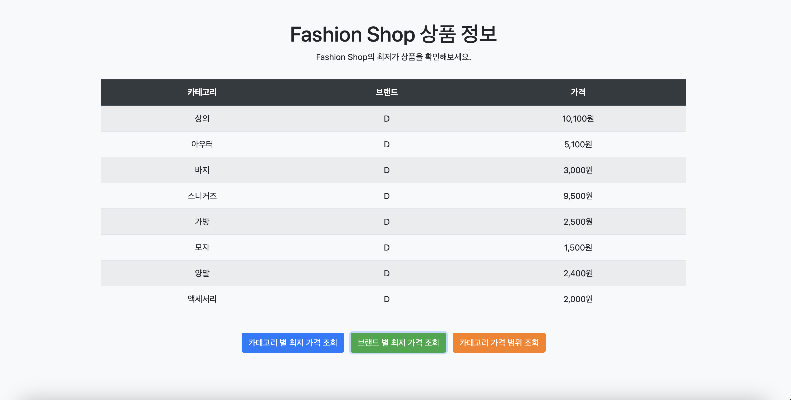

#  Fashion Shop Service

[](https://www.oracle.com/java/) [](https://spring.io/projects/spring-boot) [](https://www.h2database.com/html/main.html) [](https://redis.io/)

---

## Table of Contents
1. [Project Overview](#project-overview)
2. [Tech Stack](#tech-stack)
3. [Architecture & Modules](#architecture--modules)
4. [Getting Started](#getting-started)
    - [Prerequisites](#prerequisites)
    - [Clone & Build](#clone--build)
    - [Run Services](#run-services)
5. [API Reference](#api-reference)
    - [Customer Service](#customer-service-api)
    - [Backoffice Service](#backoffice-service-api)
6. [Data Initialization](#data-initialization)
7. [Frontend View](#frontend-view)

---

## Project Overview

**Fashion Shop Service**는 패션 상품의 조회와 관리 기능을 제공하는 **멀티모듈 웹 애플리케이션**입니다. 고객은 다양한 카테고리의 최저가 정보 및 브랜드별 가격 통계를 확인할 수 있으며, 운영자는 상품·브랜드·카테고리를 편리하게 관리할 수 있습니다.

## Tech Stack

- **Language & Runtime:** Java 17 (Amazon Corretto)
- **Framework:** Spring Boot 3.3.4
- **Database:** H2 (in-memory)
- **Cache:** Redis
- **Build Tool:** Gradle (Wrapper)

## Architecture & Modules



| Module               | Description                                       |
|----------------------|---------------------------------------------------|
| **core**             | 공통 엔티티 및 도메인 로직                         |
| **customer-service** | 고객용 API (최저가, 가격 범위 조회)                |
| **backoffice-service** | 관리자용 API (상품/브랜드/카테고리 관리)         |

## Getting Started

### Prerequisites
- Java 17+ installed
- Redis running on `localhost:6379` (for cache)
- (Optional) Docker for Redis container:

```bash
docker run -d --name redis -p 6379:6379 redis
 ```

### Clone & Build
```bash
git clone https://github.com/yunyoung1819/fashionshop-service.git
cd fashionshop-service
./gradlew build
```

### Run Services
```bash
# Customer Service (port 8081)
./gradlew :customer-service:bootRun

# Backoffice Service (port 8082)
./gradlew :backoffice-service:bootRun
```


## API Reference

### Customer Service API
| Endpoint                                   | Method | Description                                           |
|--------------------------------------------|--------|-------------------------------------------------------|
| `/v1/customer/products/categories/lowest-price` | GET    | 카테고리별 최저가 상품 조회                             |
| `/v1/customer/products/brands/lowest-price`     | GET    | 단일 브랜드별 최저가 전체 카테고리 조회                |
| `/v1/customer/products/categories/{name}/range` | GET    | 특정 카테고리의 최저/최고가 브랜드 및 가격 조회        |

- **Swagger UI:** http://localhost:8081/v1/customer/swagger-ui.html

### Backoffice Service API
| Endpoint                             | Method | Description                    |
|--------------------------------------|--------|--------------------------------|
| `/v1/backoffice/products`            | POST   | 상품 등록                      |
| `/v1/backoffice/products/{id}`       | PATCH  | 상품 수정                      |
| `/v1/backoffice/products/{id}`       | DELETE | 상품 삭제                      |
| `/v1/backoffice/categories`          | POST   | 카테고리 등록                  |
| `/v1/backoffice/categories/{id}`     | PATCH  | 카테고리 수정                  |
| `/v1/backoffice/categories/{id}`     | DELETE | 카테고리 삭제                  |
| `/v1/backoffice/brands`              | POST   | 브랜드 등록                    |
| `/v1/backoffice/brands/{id}`         | PATCH  | 브랜드 수정                    |
| `/v1/backoffice/brands/{id}`         | DELETE | 브랜드 삭제                    |

- **Swagger UI:** http://localhost:8082/v1/backoffice/swagger-ui.html

## Data Initialization
애플리케이션 시작 시 H2 내장 DB에 샘플 데이터를 자동 삽입합니다. `src/main/resources/schema.sql` 및 `data.sql` 참고.

```sql
-- 브랜드
INSERT INTO brand (name) VALUES
('A'),('B'),('C'),('D'),('E'),('F'),('G'),('H'),('I');

-- 카테고리
INSERT INTO category (name) VALUES
('상의'),('아우터'),('바지'),('스니커즈'),('가방'),('모자'),('양말'),('액세서리');

-- 상품 (예시 일부)
INSERT INTO product (brand_id, category_id, price) VALUES
(1,1,11200),(1,2,5500),...;
```

## Frontend View
- **URL:** http://localhost:8081/v1/customer/products/view
- **기능:**
    - 카테고리별 최저가 조회
    - 브랜드별 최저가 조회
    - 카테고리 가격 범위 조회

<p align="center">
  
</p>

---

*© 2025 Fashion Shop Service*

